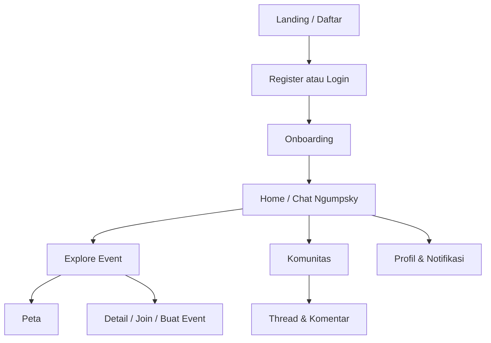

# NgumpulYuk — Frontend

Aplikasi web **NgumpulYuk** untuk menemukan event, bergabung dengan circle (komunitas), berdiskusi, melihat peta event, dan chat dengan asisten **Ngumpsky**.

## Deskripsi

Frontend dibangun sebagai SPA React dengan arsitektur berlapis (presentation → application → infrastructure), UI komponen shadcn/Radix + Tailwind, dan integrasi ke REST API backend Django.

Landing page publik menampilkan statistik & event/komunitas unggulan; setelah login, pengguna memakai shell **chat-first** (navigasi bawah di mobile, sidebar di desktop).

## Fitur utama

| Area | Fitur |
|------|--------|
| **Landing** | Hero, event trending, circle, CTA daftar, SEO |
| **Auth** | Login, register, verifikasi email, lupa/reset password, Google Sign-In |
| **Onboarding** | Minat, lokasi (514 kab/kota), waktu favorit |
| **Explore** | Daftar event upcoming & past, filter kategori, pagination |
| **Event** | Detail, buat/edit event, join/leave, upload cover, peta lokasi |
| **Peta** | Semua marker event upcoming/ongoing, filter, lokasi user |
| **Komunitas** | Feed thread global, circle, detail circle, thread & komentar |
| **Chat** | Ngumpsky — rekomendasi & tanya jawab event/komunitas |
| **Profil** | Edit profil, riwayat event, statistik |
| **Notifikasi** | Daftar notifikasi, blast (staff) |
| **Admin** | Monitoring chat & koreksi (staff) |

## Teknologi

- **React 19** + **Vite 8**
- **React Router 7**
- **Tailwind CSS 3**
- **shadcn/ui** / **Radix UI**
- **Axios** — HTTP client ke API
- **Leaflet** + **react-leaflet** — peta event
- **Framer Motion** — animasi landing
- **date-fns** — tanggal
- **Sonner** — toast notifikasi

## Alur user



1. Pengunjung melihat landing → daftar atau masuk.
2. Onboarding: pilih minat, kab/kota preferensi, slot waktu.
3. **Chat** sebagai hub utama; sidebar/menu ke Explore, Peta, Komunitas, Profil.
4. Explore event → buka detail → gabung atau buat event (area lokasi + pin di peta).
5. Komunitas: spill di feed, join circle, diskusi di thread.
6. Notifikasi untuk aktivitas terkait event & komunitas.

## Prasyarat

- **Node.js** 18+ (disarankan 20 LTS)
- Backend API NgumpulYuk berjalan (lihat README backend)
- Google OAuth Client ID (opsional, untuk tombol Google)
- Supabase keys (jika fitur terkait storage/auth client dipakai)

## Menjalankan project

### 1. Install dependensi

```bash
cd ngumpulyuk-frontend
npm install
```

### 2. Environment variables

Buat file **`.env`** di root frontend:

```env
VITE_API_BASE_URL=http://127.0.0.1:8000/api
VITE_GOOGLE_CLIENT_ID=your-google-client-id.apps.googleusercontent.com
VITE_SUPABASE_URL=
VITE_SUPABASE_PUBLISHABLE_DEFAULT_KEY=

# URL publik (production) — SEO, Open Graph, canonical
VITE_SITE_URL=http://localhost:5173
```

File `.env` jangan di-commit. Contoh variabel di atas cukup untuk development lokal.

### 3. Development server

```bash
npm run dev
```

Buka `http://localhost:5173` (atau port yang ditampilkan Vite).

### 4. Build production

```bash
npm run build
npm run preview
```

Deploy folder `dist/` ke Vercel, Netlify, atau static hosting lain; set environment variables di dashboard hosting.

## Struktur folder (ringkas)

```
ngumpulyuk-frontend/
├── public/                 # assets statis, landing images
├── src/
│   ├── app/                # router, providers
│   ├── presentation/       # pages & UI components
│   ├── application/        # mappers, use cases ringan
│   ├── infrastructure/     # API clients
│   └── shared/             # config, formatters, data lokasi ID
├── index.html
└── vite.config.js
```

## Scripts npm

| Perintah | Keterangan |
|----------|------------|
| `npm run dev` | Dev server + HMR |
| `npm run build` | Build production |
| `npm run preview` | Preview build lokal |
| `npm run lint` | ESLint |

## Koneksi ke backend

Pastikan `VITE_API_BASE_URL` mengarah ke backend (`/api` tanpa `/v1` — client menambahkan prefix versi).

CORS di backend harus mengizinkan origin frontend (`FRONTEND_URL`).

## Lisensi

Proyek privat — sesuaikan dengan kebijakan tim Anda.
